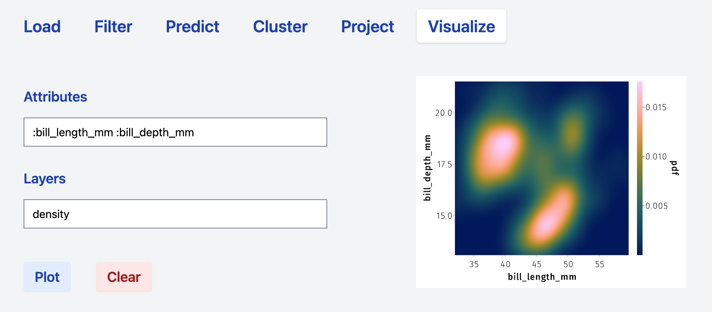
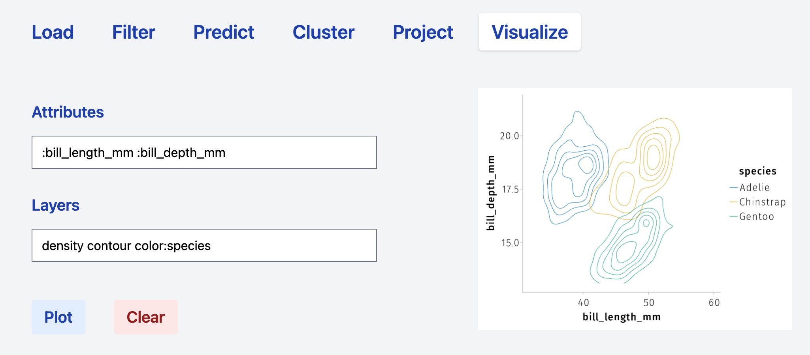
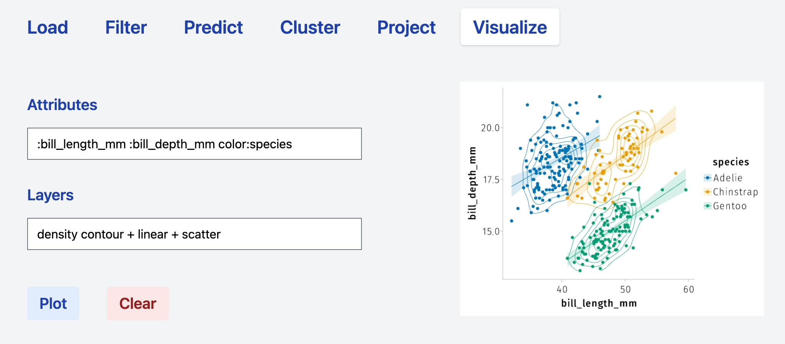
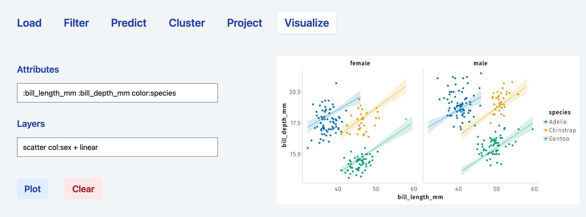

# Visualize

The visualize tab provides all the machinery for

1. performing preliminary data exploration;

2. visualizing the output of the computational tabs (prediction, clustering, dimensionality reduction).

## Fields

The tab consists of two main fields: *Attributes* and *Layers*. The way simple analyses are performed and rendered follows the philosophy of [AlgebraOfGraphics.jl](http://juliaplots.org/AlgebraOfGraphics.jl).

- **Attributes.** The attributes field contains the variable to be plotted and additional attributes that will be applied globally to the plot to be rendered. For instance, the syntax `:column_1 :column2` implies that the two selected columns will be used as `x` and `y` axis of any plot that will be produced from such attributes. Adding more attributes such as `:column_1 :column2 color:column_3` means that the `column_3` (being continuous or categorical) will be used to establish the color code associated with rendered plot. See examples in the following sections.
- **Layers.** The layer field can be filled with one or more operations that will take the content of the Attributes filed as input (and specifications) and result in a series of superposed plots. For instance the syntax: 
    ```
    Attributes:column_1 :column2 color:column_3 
    Layers: scatter
    ```
    produces a scatter plot having `column_1` and `column_2` as `x` and `y` axis, respectively, and whose points are colored according to `column_3`. The `+` operator can be used to combine layers. Thus, the syntax
    ```
    Attributes:column_1 :column2 color:column_3 
    Layers: scatter + linear
    ```
    renders a scatter plot and a plots linear models according to the grouping defined by `column_3`. Specifications relative to a specific operations can be added directly in the `Layers` field. See the sections below for specific examples.

In the following sections, we will use the [palmerpenguins dataset](https://allisonhorst.github.io/palmerpenguins/index.html) to describe the most common computational steps in data exploration.

## Layers

### Frequency


#### Dodge


#### Stack


### Scatter

#### Color


#### Marker


### Linear


### Density



#### Contour



## Combine layers




## Split by categorical variable




